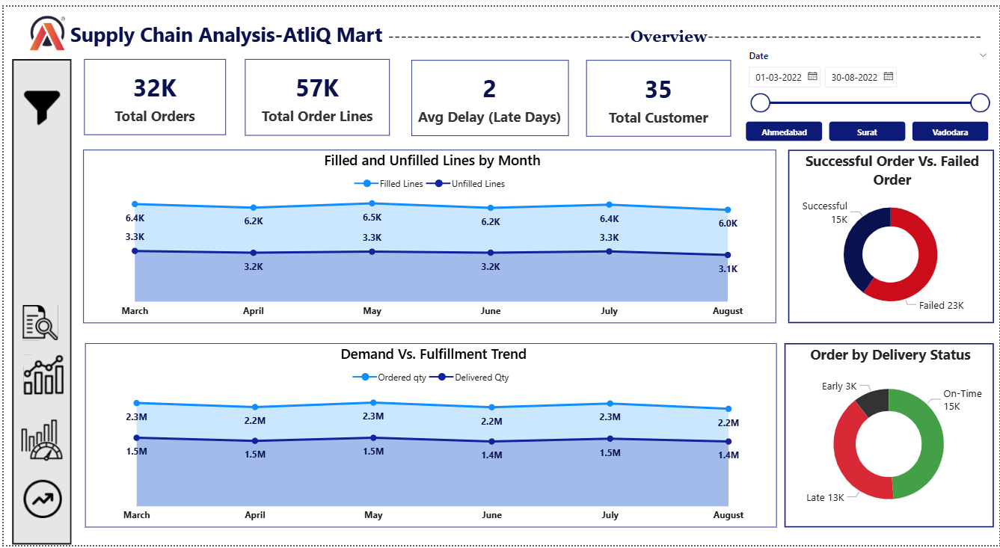
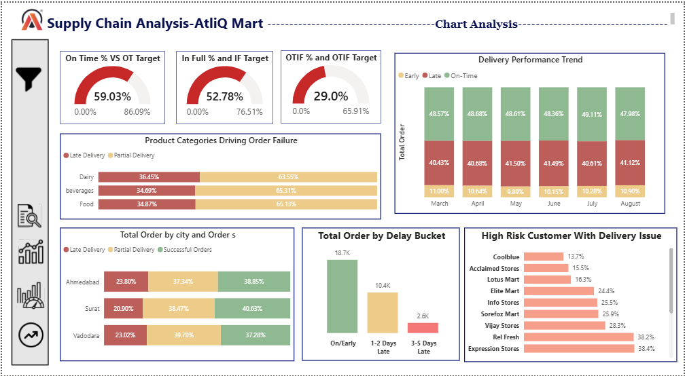

# 📦 AtliQ Mart Supply Chain Analysis

### 🚀 Improving OTIF Performance & Reducing Customer Churn

---

## 🧭 Project Snapshot

📊 **Domain:** FMCG Supply Chain
🎯 **Goal:** Improve service levels (OT%, IF%, OTIF%)
🛠 **Tools Used:** Power BI | SQL | Excel
📅 **Analysis Period:** Dec 2024 – May 2025

---

## ⚡ Business Problem

AtliQ Mart is experiencing **declining customer retention** due to:

* Late deliveries
* Incomplete orders
* Poor service consistency

💡 These issues directly impact:

* Customer satisfaction
* Contract renewals
* Revenue growth

---

## 🎯 Objectives

✔ Analyze service level KPIs (OT%, IF%, OTIF%)
✔ Identify gaps vs targets
✔ Detect high-risk customers
✔ Perform root cause analysis
✔ Recommend actionable solutions

---

## 📊 KPI Framework

| Metric    | Definition        | Business Impact        |
| --------- | ----------------- | ---------------------- |
| **OT%**   | On-Time Delivery  | Delivery reliability   |
| **IF%**   | In-Full Delivery  | Inventory efficiency   |
| **OTIF%** | On-Time + In-Full | End-to-end performance |

---

## 📉 Key Insights (Executive Summary)

### 🔴 1. Critical Service Level Gaps

* OT%, IF%, and OTIF% are **below target**
* **OTIF% shows the largest gap → biggest business risk**

---

### ⚠️ 2. High-Risk Customers Identified

| Customer        | Issue                        |
| --------------- | ---------------------------- |
| Coolblue        | High delays + partial orders |
| Acclaimed Store | Balanced issues              |
| Lotus Mart      | Severe gaps                  |
| Elite Mart      | High partial deliveries      |

👉 These accounts contribute significantly to **revenue risk & churn**

---

### 🔍 3. Root Cause Analysis

Primary drivers of poor performance:

* 🚚 Delivery delays
* 📦 Partial shipments
* 📉 Inventory shortages

💡 Insight:

> IF% gap is smaller than OTIF → improving fulfillment gives **quick wins**

---

## 📦 Operational Gaps Identified

* Weak demand forecasting
* Poor inventory planning
* Warehouse-logistics misalignment
* Inefficient delivery scheduling

---

## 💡 Strategic Recommendations

### 1️⃣ Strengthen Supply Planning

* Improve demand forecasting models
* Maintain optimal safety stock
* Reduce stockouts

---

### 2️⃣ Focus on In-Full Delivery (Quick Wins 🚀)

* Prioritize complete order fulfillment
* Improve warehouse inventory accuracy

---

### 3️⃣ Optimize Logistics

* Route optimization
* Reduce delivery lead time variability

---

### 4️⃣ Customer Retention Strategy

* Track high-risk customers
* Implement proactive service recovery

---

## 📈 Business Impact (Expected Outcomes)

| Area               | Impact                  |
| ------------------ | ----------------------- |
| OTIF%              | Significant improvement |
| Customer Retention | Reduced churn           |
| Operations         | Higher efficiency       |
| Revenue            | Improved stability      |

---

## 📊 Dashboard Preview

### 🔹 Overview Dashboard


### 🔹 KPI Analysis


### 🔹 Root Cause Analysis


### 🔹 Trend Analysis


---

## 🛠 Tech Stack

* 📊 Power BI – Interactive dashboards

---

## 📁 Project Structure

```
📦 AtliQ-Supply-Chain-Analysis
 ┣ 📄 README.md
 ┣ 📊 AtliQ_Dashboard.pbix
 ┣ 📽️ AtliQ_Presentation.pptx
 ┣ 📁 images
 ┃ ┣ dashboard_overview.png
 ┃ ┣ kpi_analysis.png
 ┃ ┗ customer_analysis.png
 ┗ 📁 dataset (optional)

```

---

## 🚀 Key Takeaway

This project demonstrates how **data-driven supply chain analysis** can:

* Identify service bottlenecks
* Improve operational efficiency
* Drive business decision-making

---
## 📥 Project Files

- 📊 [Download Power BI Dashboard](AtliQ_Dashboard.pbix)
- 📽️ [Download Presentation](AtliQ_Presentation.pptx)


## 👩‍💻 About Me

Aspiring Data Analyst with experience in:

* Power BI Dashboarding
* SQL & Data Transformation
* Business Problem Solving

## 🌐 Live Portfolio
👉 https://ghosh-monalika-portfolio.netlify.app/

---

## 📬 Let’s Connect

If you're a recruiter or data enthusiast, feel free to connect or reach out!

---
